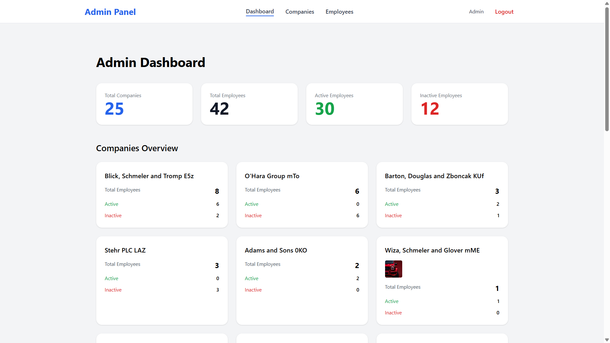
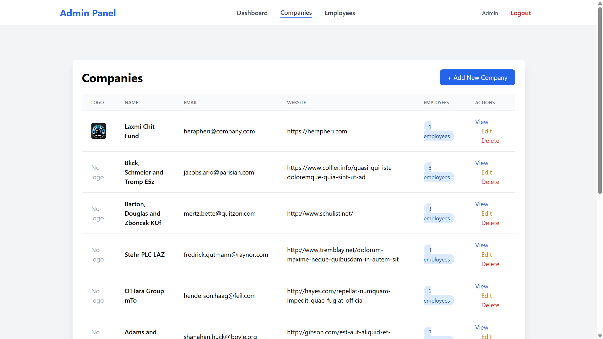
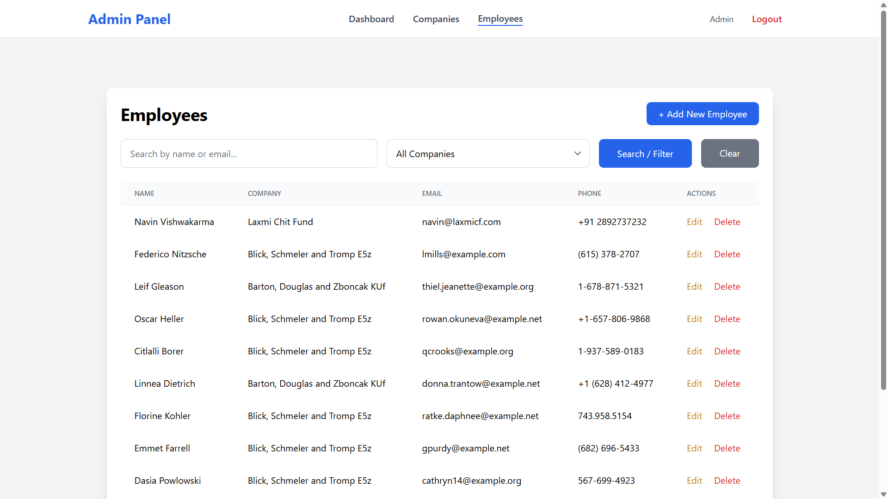
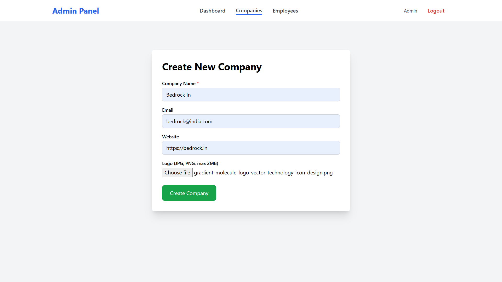
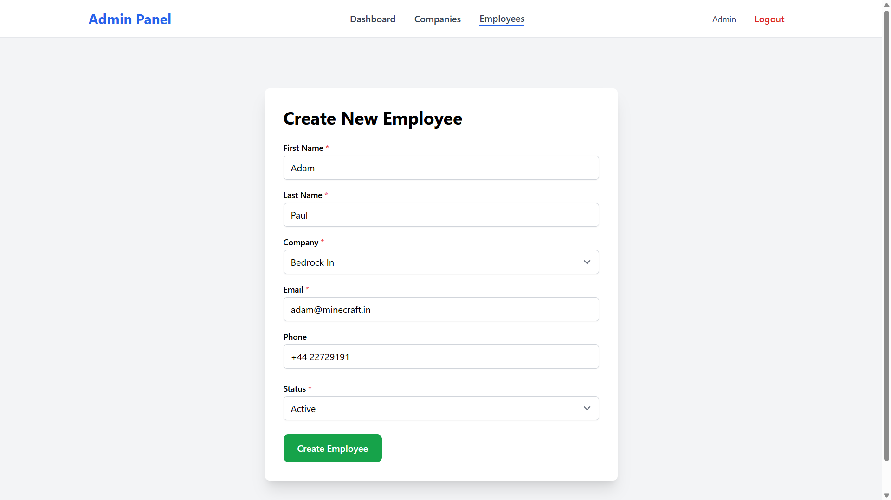

# Laravel Company Employee Admin

A Laravel-based web application for managing companies and their employees. This application provides a simple admin interface to create, read, update, and delete companies and employees, with features like search, filtering, and soft delete.

## Features

- **Company Management**: Create, edit, delete companies with logo upload
- **Employee Management**: Add, edit, and soft delete employees
- **Search & Filter**: Search employees by name/email and filter by company
- **Dashboard**: Overview of companies with employee counts
- **Soft Delete**: Employees can be soft deleted and restored
- **Responsive UI**: Built with Tailwind CSS for mobile-friendly design
- **Authentication**: User authentication system (if implemented)

## Prerequisites

Before you begin, ensure you have the following installed on your system:

- **PHP** >= 8.1
- **Composer** (PHP dependency manager)
- **Node.js** >= 16.x and **npm** (for frontend assets)
- **MySQL** or **PostgreSQL** (database)
- **Git** (for cloning the repository)

## Installation

Follow these steps to set up the project locally:

### 1. Clone the Repository

```bash
git clone https://github.com/Bluepanda-Code/laravel-company-employee-admin.git
cd laravel-company-employee-admin
```

### 2. Install PHP Dependencies

```bash
composer install
```

### 3. Install Node.js Dependencies

```bash
npm install
```

### 4. Environment Configuration

Copy the `.env.example` file to `.env` and configure your environment variables:

```bash
cp .env.example .env
```

Edit the `.env` file to set up your database connection and other settings:

```env
APP_NAME="Laravel Company Employee Admin"
APP_ENV=local
APP_KEY=
APP_DEBUG=true
APP_URL=http://localhost

DB_CONNECTION=mysql
DB_HOST=127.0.0.1
DB_PORT=3306
DB_DATABASE=company_employee_admin
DB_USERNAME=your_username
DB_PASSWORD=your_password

# Other configurations...
```

Generate the application key:

```bash
php artisan key:generate
```

### 5. Database Setup

Create a database in your MySQL/PostgreSQL server that matches the `DB_DATABASE` value in your `.env` file.

Run the migrations to create the database tables:

```bash
php artisan migrate
```

(Optional) Seed the database with sample data:

```bash
php artisan db:seed
```

### 6. Build Frontend Assets

Compile the CSS and JavaScript assets:

For development (with hot reload):

```bash
npm run dev
```

For production build:

```bash
npm run build
```

### 7. Start the Development Server

```bash
php artisan serve
```

The application will be available at `http://localhost:8000`.

## Usage

### Accessing the Application

1. Open your browser and navigate to `http://localhost:8000`
2. Register/Login if authentication is enabled
3. Use the dashboard to manage companies and employees

### Key Routes

- `/companies` - List all companies
- `/companies/create` - Create a new company
- `/employees` - List all employees with search/filter
- `/employees/create` - Create a new employee

### Admin Features

- **Companies**: View, create, edit, delete companies. Cannot delete companies with employees.
- **Employees**: View, create, edit, soft delete employees. Cannot delete the last employee in a company.
- **Search**: Use the search bar to find employees by name or email.
- **Filter**: Filter employees by company using the dropdown.

## Screenshots

### Dashboard


### Companies List


### Employees List


### Add Company


### Add Employee


*Note: Replace the placeholder images in the `screenshots/` folder with actual screenshots of your application.*

## Project Structure

```
├── app/
│   ├── Http/Controllers/
│   │   ├── CompanyController.php
│   │   └── EmployeeController.php
│   └── Models/
│       ├── Company.php
│       ├── Employee.php
│       └── User.php
├── database/
│   ├── migrations/
│   └── seeders/
├── resources/
│   ├── views/
│   │   ├── companies/
│   │   ├── employees/
│   │   └── layouts/
│   └── css/
├── routes/
│   └── web.php
└── public/
    └── storage/ (for uploaded logos)
```

## Contributing

Contributions are welcome! Please follow these steps:

1. Fork the repository
2. Create a feature branch (`git checkout -b feature/amazing-feature`)
3. Commit your changes (`git commit -m 'Add some amazing feature'`)
4. Push to the branch (`git push origin feature/amazing-feature`)
5. Open a Pull Request

## License

This project is licensed under the MIT License - see the [LICENSE](LICENSE) file for details.

## Support

If you have any questions or issues, please open an issue on GitHub or contact the maintainers.

In order to ensure that the Laravel community is welcoming to all, please review and abide by the [Code of Conduct](https://laravel.com/docs/contributions#code-of-conduct).

## Security Vulnerabilities

If you discover a security vulnerability within Laravel, please send an e-mail to Taylor Otwell via [taylor@laravel.com](mailto:taylor@laravel.com). All security vulnerabilities will be promptly addressed.

## License

The Laravel framework is open-sourced software licensed under the [MIT license](https://opensource.org/licenses/MIT).
